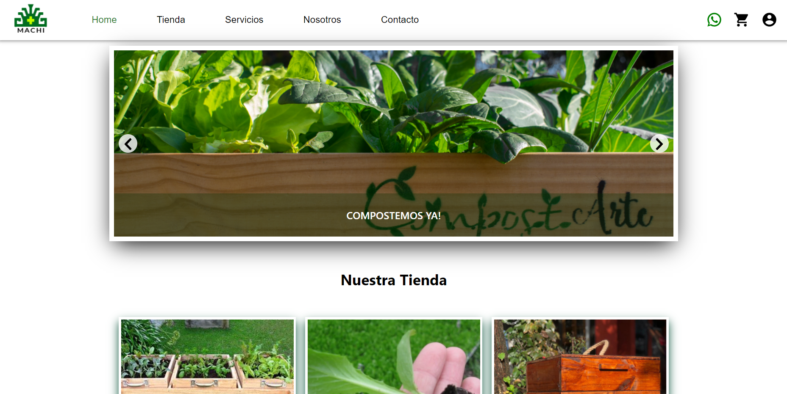
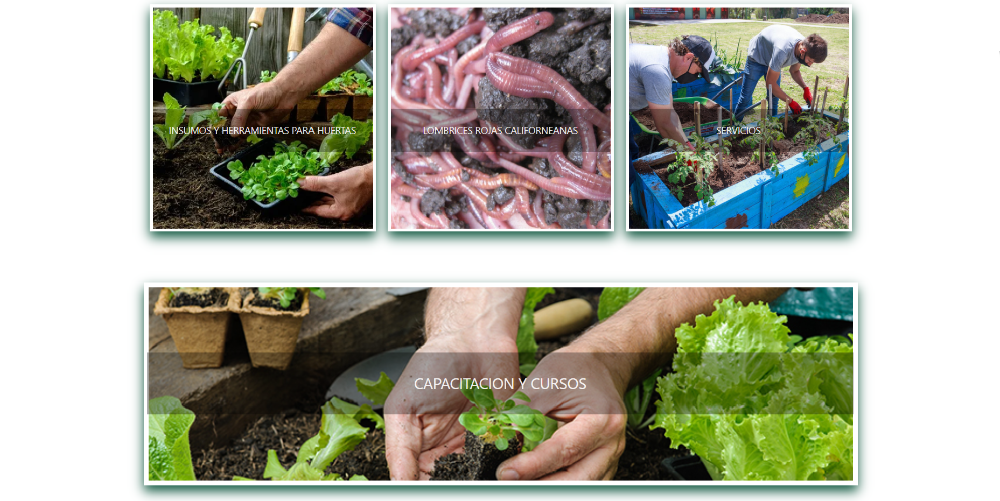
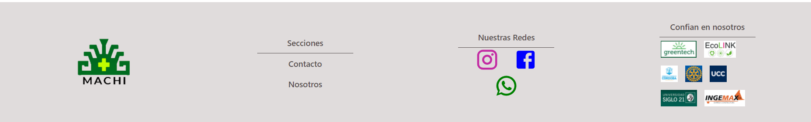
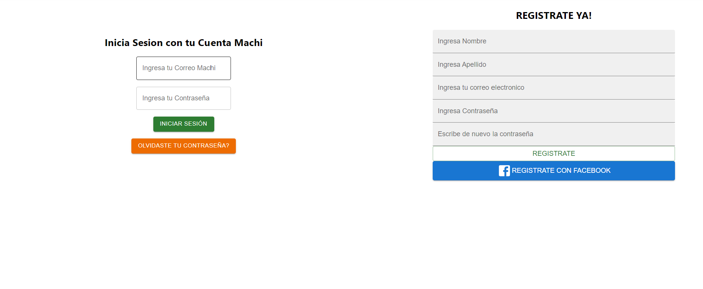
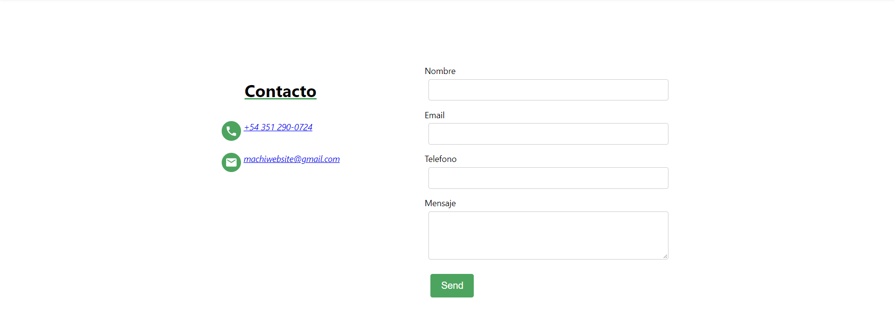
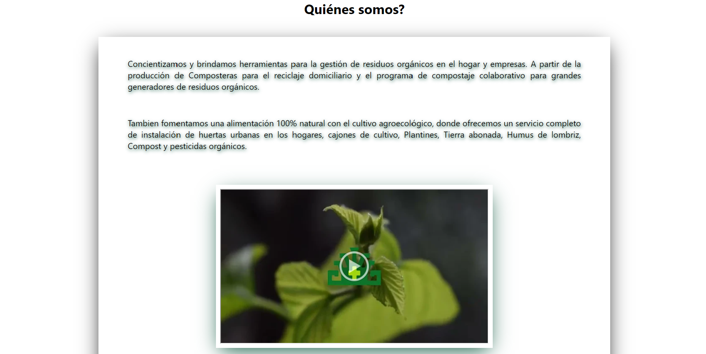

# E-Commerce-Machi

E-Commerce Proyect done in JS with ReactJS, ReduxJS, Express, Sequelize, PostgreSQL, 
NODE.JS, MaterialUI, Passport, Etc.

<iframe width="640" height="360" frameborder="0" src="https://mega.nz/embed/LAtBAaYa#8Ddu_X2DsfUePq5y_bM6qX5vHaklXN2K6PFdN5TzoLM" allowfullscreen ></iframe>

    <h2>Home</h>
    
    
    
    <h2>Log In </h>
    
    <h2>Contact </h>
    
    <h2>About Us </h>
    

## To ejecute: 
*In api folder on the temrinal, run 'npm install', then 'npm start' to start the server (port 3001). 
*To start the Front , go to client folder in the temrinal, and run 'npm start'. 

DEPLOY LINK
https://ecommerce-machi.netlify.app

## Elaborated by:

- Anyel Lopez https://github.com/any-18

- Hector Julian Robayo https://github.com/akiibajin

- Jorge Cuadrado Velasquez https://github.com/jorge9805

- Martín Otero https://github.com/C0d3Drak3

- Mauro Arnedo https://github.com/mauroarnedo 

- Ruben Alejandro Bazan https://github.com/rubensauriosD

- Veronica Camisassa https://github.com/verita022
